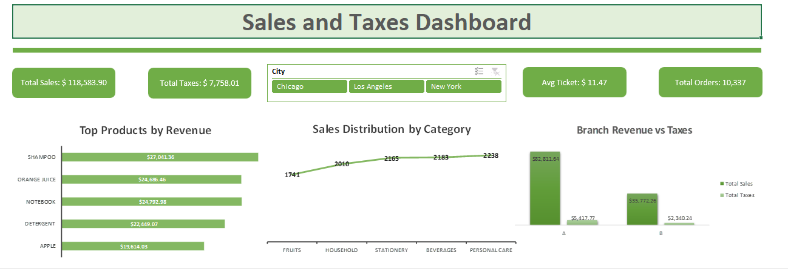
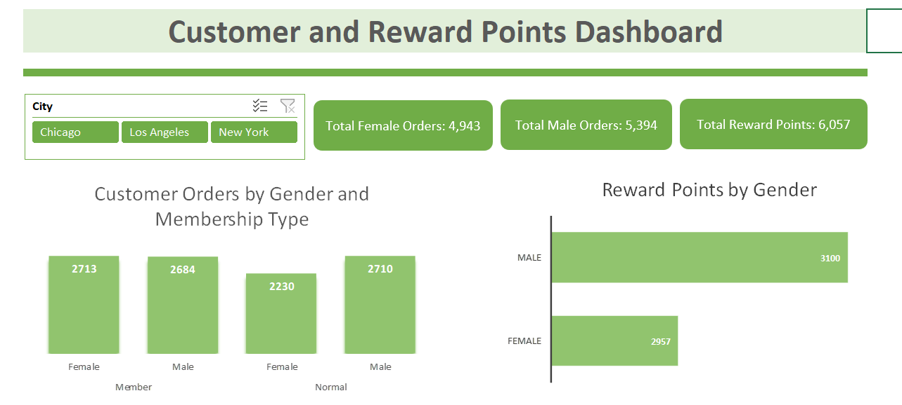

# 📊 Sales & Customer Analytics Excel Dashboards

  

  

  
  
  

---

# 🇧🇷 Português

## 🎯 Objetivo

Projeto desenvolvido no Microsoft Excel com foco em análise de vendas, impostos, comportamento de clientes e sistema de recompensas utilizando dashboards interativos e KPIs dinâmicos.

Os dois dashboards utilizam o mesmo dataset e foram criados para demonstrar habilidades em análise de dados, visualização de informações e construção de indicadores de negócio.

---

# 📈 Dashboards Desenvolvidos

## 📊 Sales and Taxes Dashboard

Dashboard voltado para análise comercial e tributária.

### 🔹 KPIs
- Total de Vendas
- Total de Impostos
- Ticket Médio
- Total de Pedidos

### 🔹 Visualizações
- Produtos com maior faturamento
- Distribuição de vendas por categoria
- Comparação entre faturamento e impostos por filial

---

## 👥 Customer and Reward Points Dashboard

Dashboard voltado para análise de clientes e sistema de pontos.

### 🔹 KPIs
- Total de pedidos femininos
- Total de pedidos masculinos
- Total de pontos de recompensa

### 🔹 Visualizações
- Pedidos por gênero e tipo de assinatura
- Pontos acumulados por gênero

---

## 🛠 Habilidades Demonstradas

- Dashboards Interativos
- Tabelas Dinâmicas
- Gráficos Dinâmicos
- Segmentação de Dados (Slicers)
- Fórmulas Avançadas
- SOMASES
- Análise de Dados
- Business Intelligence
- Visualização de Dados
- KPIs Dinâmicos
- Formatação Condicional

---

## 🧠 Fórmulas Utilizadas

O projeto utiliza fórmulas avançadas para construção de KPIs e métricas dinâmicas.

### 🔹 Principais Fórmulas
- `SOMASES`
- `SE`
- `MÉDIA`

### 🔹 Aplicações
- Soma dinâmica de vendas e impostos
- Contagem de pedidos por gênero
- Cálculo de ticket médio
- Indicadores automáticos baseados em filtros

---

## ⚙️ Ferramentas Utilizadas

- Microsoft Excel
- Pivot Tables
- Pivot Charts
- Slicers
- SOMASES
- INDEX + MATCH
- Formatação Condicional

---

## 📂 Dataset

O dataset contém dados fictícios relacionados a:
- Produtos
- Categorias
- Clientes
- Gênero
- Cidades
- Impostos
- Pontos de recompensa
- Pedidos
- Receita de vendas

---

# 🇺🇸 English

## 🎯 Objective

Project developed in Microsoft Excel focused on sales, taxes, customer behavior and reward system analysis using interactive dashboards and dynamic KPIs.

Both dashboards use the same dataset and were created to demonstrate skills in data analysis, business intelligence and data visualization.

---

# 📈 Developed Dashboards

## 📊 Sales and Taxes Dashboard

Dashboard focused on commercial and tax analysis.

### 🔹 KPIs
- Total Sales
- Total Taxes
- Average Ticket
- Total Orders

### 🔹 Visualizations
- Top products by revenue
- Sales distribution by category
- Revenue vs taxes by branch

---

## 👥 Customer and Reward Points Dashboard

Dashboard focused on customer and reward points analysis.

### 🔹 KPIs
- Total female orders
- Total male orders
- Total reward points

### 🔹 Visualizations
- Orders by gender and membership type
- Reward points by gender

---

## 🛠 Skills Demonstrated

- Interactive Dashboards
- Pivot Tables
- Pivot Charts
- Data Slicers
- Advanced Formulas
- SUMIFS
- Data Analysis
- Business Intelligence
- Data Visualization
- Dynamic KPIs
- Conditional Formatting

---

## 🧠 Formula Logic Used

The project uses advanced formulas for KPI creation and dynamic metrics.

### 🔹 Main Formulas
- `SUMIFS`
- `IF`
- `AVERAGE`

### 🔹 Applications
- Dynamic sales and taxes aggregation
- Order count by gender
- Average ticket calculation
- Automatic KPI updates based on filters

---

## ⚙️ Tools Used

- Microsoft Excel
- Pivot Tables
- Pivot Charts
- Slicers
- SUMIFS
- INDEX + MATCH
- Conditional Formatting

---

## 📂 Dataset

The dataset contains fictional information related to:
- Products
- Categories
- Customers
- Gender
- Cities
- Taxes
- Reward points
- Orders
- Sales revenue

---

# 🚀 Future Improvements

- Power Query automation
- Power Pivot relationships
- Profit margin analysis
- Customer segmentation
- Advanced business KPIs
- Forecasting analysis

---

## 👨‍💻 Author

### Marcelo Pereira

---

# 📚 Dataset Reference | Referência do Dataset

🇺🇸 Dataset used in this project was provided by:

🔗 https://www.kaggle.com/datasets/chadwambles/supermarket-sales

Special thanks to the dataset creator for making the data publicly available for analysis and educational purposes.

---

🇧🇷 O dataset utilizado neste projeto foi disponibilizado por:

🔗 https://www.kaggle.com/datasets/chadwambles/supermarket-sales

Agradecimentos ao criador do dataset por disponibilizar os dados publicamente para fins educacionais e analíticos.

---

